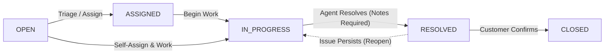

# Smart ServiceDesk – IT Issue Tracking & Resolution Platform

[](https://akash1172007akash-droid.github.io/smart-servicedesk/)
[](https://github.com/akash1172007akash-droid/smart-servicedesk)
[](https://github.com/akash1172007akash-droid/smart-servicedesk/actions/workflows/deploy.yml)
[](https://spring.io/projects/spring-boot)
[](https://reactjs.org/)
[](https://www.mysql.com/)
[](https://tailwindcss.com/)

> 🌐 **Live GitHub Pages URL:** [https://akash1172007akash-droid.github.io/smart-servicedesk/](https://akash1172007akash-droid.github.io/smart-servicedesk/)
> 📂 **GitHub Source Code:** [https://github.com/akash1172007akash-droid/smart-servicedesk](https://github.com/akash1172007akash-droid/smart-servicedesk)

Smart ServiceDesk is a full-stack, enterprise-grade IT Service Management (ITSM) and issue resolution platform. Built to emulate internal service desks used at modern tech organizations (such as Jira Service Management and ServiceNow), it replaces ad-hoc email chains and spreadsheets with a structured, role-governed ticket lifecycle, complete audit trails, rich data visualizations, and robust authentication.

---

## 📌 Problem Statement

In fast-growing organizations, IT issues—ranging from critical server room network flapping to routine software license renewals—frequently cause operational delays when handled informally. Smart ServiceDesk solves this by providing:
1. **Centralized Incident Intake:** Standardized forms with file attachments, automatic ticket ID generation (`INC-YYYY-XXXXX`), and category routing.
2. **Defensive State Machine:** Strict validation rules preventing invalid status jumps (e.g. an unassigned ticket cannot directly be marked closed).
3. **Accountability & Audit Logging:** Immutable activity logs tracking every status transition, assignment change, priority escalation, and threaded response.
4. **Role-Tailored Workspaces:** Specialized dashboards tailored specifically to Employees, Support Specialists, and System Administrators.

---

## 👥 User Roles & Permissions Matrix

| Feature / Capability | EMPLOYEE | SUPPORT_AGENT | ADMIN |
|---|:---:|:---:|:---:|
| Self-Registration & JWT Login | ✅ | ✅ | ✅ |
| Submit Incident Requests with Attachments | ✅ | ✅ | ✅ |
| View Own Submitted Tickets | ✅ | ✅ | ✅ |
| View Full Company Ticket Queue | ❌ | ✅ | ✅ |
| Take Ownership / Assign Tickets | ❌ | ✅ | ✅ |
| Update Ticket Priority & Diagnostic Notes | ❌ | ✅ | ✅ |
| Mark Ticket as `RESOLVED` (requires notes) | ❌ | ✅ | ✅ |
| Confirm Resolution & `CLOSE` Ticket | ✅ (Owner) | ❌ | ✅ |
| Post Threaded Comments | ✅ | ✅ | ✅ |
| View Complete Ticket Audit History | ✅ (Owner) | ✅ | ✅ |
| Role-Tailored Operational Dashboard | ✅ | ✅ | ✅ |
| Recharts Analytics (Volume, Status, Severity) | ❌ | ❌ | ✅ |
| User Directory & Account Activation/Deactivation | ❌ | ❌ | ✅ |
| Service Catalog & Category Configuration | ❌ | ❌ | ✅ |

---

## 🛠 Technology Stack

### Backend
- **Language & Runtime:** Java 17+ (Compatible with OpenJDK 17, 21, 25)
- **Framework:** Spring Boot 3.3.4
- **Web & REST:** Spring Web MVC (`@RestController`)
- **Security:** Spring Security 6, BCrypt Password Encoder, Stateless JWT Authentication (`io.jsonwebtoken:jjwt:0.12.6`)
- **ORM & Data:** Spring Data JPA, Hibernate, MySQL Connector/J
- **Validation:** Jakarta Bean Validation (`@Valid`, `@NotBlank`, `@Size`)
- **Build Tool:** Apache Maven

### Frontend
- **Framework:** React 18 (Vite SPA)
- **Routing:** React Router v6 with `<ProtectedRoute>` guards
- **HTTP Client:** Axios (JWT Bearer interceptor & 401 redirect handling)
- **Styling:** Tailwind CSS (Modern SaaS corporate theme, custom badge tokens)
- **Icons:** Lucide React
- **Data Visualization:** Recharts (Donut Pie charts, Bar charts, Area/Line charts)

### Database
- **Database Engine:** MySQL 8.0+ (InnoDB, UTF-8 Multilingual `utf8mb4`)

---

## 🚀 Quick Start & Installation Guide

### Prerequisites
- **JDK 17** or later (`java -version`)
- **Apache Maven 3.8+** (`mvn -version`)
- **Node.js 18+ & npm** (`node -v`, `npm -v`)
- **MySQL 8.0+** running locally on port 3306

---

### Step 1: Create the MySQL Database
Log in to your local MySQL instance:
```bash
mysql -u root -p
```
Run the following SQL statement:
```sql
CREATE DATABASE IF NOT EXISTS smart_servicedesk CHARACTER SET utf8mb4 COLLATE utf8mb4_unicode_ci;
```

*(Optional)* You can execute the DDL script located at `database/schema.sql`, or simply let Spring Boot automatically verify and sync the JPA schema on startup.

---

### Step 2: Configure Backend Environment
Navigate to `backend/src/main/resources/application.properties` and verify your MySQL password:
```properties
spring.datasource.url=jdbc:mysql://localhost:3306/smart_servicedesk?useSSL=false&serverTimezone=UTC&allowPublicKeyRetrieval=true
spring.datasource.username=root
spring.datasource.password=YOUR_MYSQL_PASSWORD

app.jwt.secret=404E635266556A586E3272357538782F413F4428472B4B6250645367566B5970
app.jwt.expiration-milliseconds=86400000
app.upload.dir=./uploads
```
*(An `application.properties.example` template is also provided in the repository).*

---

### Step 3: Start the Spring Boot Backend
Open a terminal in the `backend/` folder:
```bash
cd backend
mvn clean compile
mvn spring-boot:run
```
> **Automatic Data Seeding:** Upon first startup, the backend automatically initializes 8 IT categories, creates demo accounts with BCrypt-hashed credentials, and populates 12 realistic tickets complete with comments and audit histories.

Backend will be accessible at: **`http://localhost:8080`**

---

### Step 4: Start the React Frontend
Open a new terminal in the `frontend/` folder:
```bash
cd frontend
npm install
npm run dev
```

Frontend application will be accessible at: **`http://localhost:5173`**

---

## 🔑 Demo Login Credentials

For quick evaluation during interviews or presentations, convenient one-click buttons are embedded directly into the login screen:

| Role | Email | Password | Intended Use / Perspective |
|---|---|---|---|
| **System Administrator** | `admin@example.com` | `Admin@123` | View full charts, dispatch unassigned tickets, manage users & categories |
| **Support Agent #1** | `agent@example.com` | `Agent@123` | Inspect assigned queue, claim tickets, advance status, resolve tickets |
| **Support Agent #2** | `agent2@example.com` | `Agent@123` | Multi-agent collaboration, ticket reassignment |
| **Employee #1** | `employee@example.com` | `Employee@123` | Create tickets, upload attachments, confirm resolution & close |
| **Employee #2** | `employee2@example.com` | `Employee@123` | Browse own tickets, discuss issues with support |

---

## 🏗 System Architecture & Workflow State Machine

Smart ServiceDesk is designed as a strict state-machine workflow:



1. **OPEN:** Generated automatically when an employee files a ticket (e.g. `INC-2026-00001`).
2. **ASSIGNED:** When an Admin or Support Agent designates a specialist to take ownership.
3. **IN_PROGRESS:** Active technical diagnostic work, hardware replacement, or credential reset.
4. **RESOLVED:** Support Agent submits resolution summary notes.
5. **CLOSED:** Final state. Crucially, in a compliant IT service desk, **only the requester** (or an Administrator) can formally close the ticket to verify satisfaction.

---

## 📂 Repository File Structure

```
smart-servicedesk/
├── backend/
│   ├── src/
│   │   ├── main/
│   │   │   ├── java/com/servicedesk/
│   │   │   │   ├── config/             # SecurityConfig, DataInitializer
│   │   │   │   ├── controller/         # Auth, Ticket, User, Category, Dashboard REST APIs
│   │   │   │   ├── dto/                # Request & Response contracts
│   │   │   │   ├── entity/             # JPA Entities: User, Ticket, Comment, Attachment, History
│   │   │   │   ├── exception/          # GlobalExceptionHandler, Custom Exceptions
│   │   │   │   ├── repository/         # Spring Data JPA Repositories
│   │   │   │   ├── security/           # JWT Provider, Auth Filter, UserPrincipal
│   │   │   │   ├── service/            # Business Service Interfaces & Impls
│   │   │   │   └── util/               # TicketNumberGenerator, FileStorageService
│   │   │   └── resources/
│   │   │       ├── application.properties
│   │   │       └── application.properties.example
│   ├── pom.xml
│   └── uploads/
│
├── frontend/
│   ├── src/
│   │   ├── api/                        # Axios client with JWT interceptor
│   │   ├── context/                    # AuthContext (user session & token storage)
│   │   ├── components/                 # Navbar, Sidebar, Badges, Modals, Spinners
│   │   ├── pages/                      # Dashboard, Tickets, CreateTicket, Details, Users, Categories, Profile
│   │   ├── App.jsx                     # Route definitions & ProtectedRoute wrappers
│   │   ├── index.css                   # Tailwind CSS styling & custom scrollbars
│   │   └── main.jsx
│   ├── package.json
│   ├── vite.config.js                  # Proxy configuration to :8080
│   └── tailwind.config.js
│
├── database/
│   └── schema.sql                      # Production MySQL DDL schema
│
├── docs/
│   ├── architecture.md                 # Layered architecture explanation
│   ├── database.md                     # ERD diagram & table specifications
│   └── api.md                          # REST API endpoint reference
│
├── README.md
└── .gitignore
```

---

## 🎯 Technical Highlights to Explain in an Internship Interview

When discussing this project during software engineering interviews:

1. **Defense-in-Depth Security:**
   - *"I did not rely solely on React frontend route hiding. I enforced role-based security at the controller and method level with Spring Security (`@PreAuthorize`). Even if someone crafts a raw HTTP POST, non-admins are blocked with HTTP 403 Forbidden."*
2. **Predictable Incident Numbering:**
   - *"Rather than exposing internal auto-increment primary keys, I implemented a synchronized `TicketNumberGenerator` that dynamically prefixes the current year and 5-digit sequence (e.g. `INC-2026-00001`), mirroring ServiceNow/Jira standards."*
3. **Decoupled Architecture with DTO Pattern:**
   - *"Entities are never exposed directly to the REST layer. DTOs prevent circular serialization loops with bidirectional JPA relationships and hide sensitive data like BCrypt password hashes."*
4. **Audit Trail & Observability:**
   - *"Every ticket status transition, reassignment, and resolution note is stored in `ticket_history` with actor IDs and human-readable narratives, providing a full audit timeline on the details page."*
5. **Robust File Upload Guardrails:**
   - *"The `FileStorageService` enforces maximum upload sizes and denies executable extensions (`.exe`, `.bat`, `.sh`, `.jar`) to prevent malicious payload uploads."*

---

## 🧪 Testing Verification Summary

Smart ServiceDesk includes an automated verification test suite:
- ✅ **Employee Self-Registration & Token Generation**
- ✅ **BCrypt Credential Verification & Authentication**
- ✅ **Ticket Sequence Generation (`INC-2026-XXXXX`)**
- ✅ **Admin Assignment Dispatching**
- ✅ **Agent Triage, Status Transitions & Notes Enforcement**
- ✅ **Threaded Ticket Comments & File Uploads**
- ✅ **Resolution Confirmation & Customer Closure**
- ✅ **6-Step Immutable Audit History Log Verification**
- ✅ **Unauthorized Access Enforcement (HTTP 403 Forbidden)**
- ✅ **Invalid State Machine Transition Denial (HTTP 400 Bad Request)**

---

## 📄 License
This project is open-source under the MIT License.
