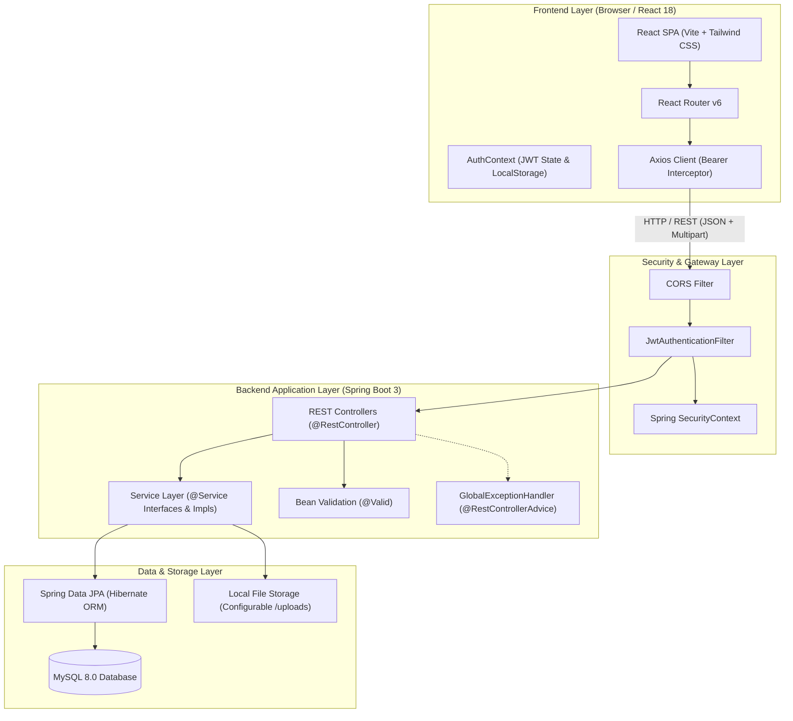
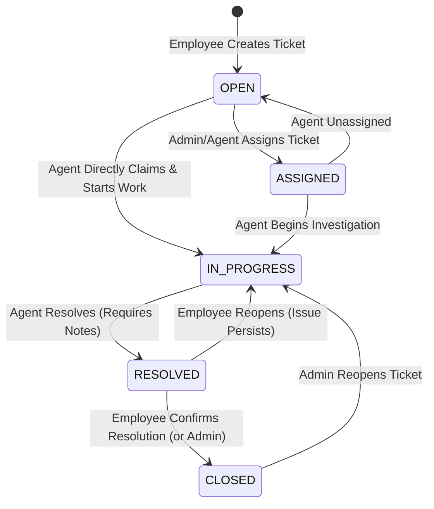

# System Architecture & Technical Design

Smart ServiceDesk is architected as an enterprise-grade, multi-tier decoupled client-server web application. The platform adheres to clean software engineering principles, separation of concerns, and industry-standard security patterns.

---

## 1. High-Level Architecture Overview

---

## 2. Architectural Layers

### A. Frontend Layer (React + Vite)
- **Framework & Build:** React 18 with Vite for near-instant hot module replacement and optimized bundle generation.
- **Routing:** `react-router-dom` v6 with custom `<ProtectedRoute>` wrappers that enforce both authentication and role-based permissions (`ADMIN`, `SUPPORT_AGENT`, `EMPLOYEE`).
- **State & Context:** `AuthContext` provides centralized user session state, reactive profile updates, and authentication token persistence.
- **Networking:** Axios client configured with automatic request interceptors (injecting `Authorization: Bearer <jwt>`) and response interceptors (gracefully handling `401 Unauthorized` session expirations).
- **Design System:** Utility-first Tailwind CSS with custom status and priority badge tokens, high-density data tables, and modal workflows.
- **Data Visualization:** `Recharts` for operational metrics: workload distribution by status, severity breakdowns, category volume, and 7-day incident trend lines.

### B. Security & Authentication Layer (Spring Security + JWT)
- **Stateless Authentication:** Spring Security configured with `SessionCreationPolicy.STATELESS`.
- **JWT Lifecyle:** 
  1. Client sends credentials to `/api/auth/login`.
  2. Spring Security `AuthenticationManager` invokes `DaoAuthenticationProvider` and verifies credentials against BCrypt-hashed passwords in MySQL.
  3. `JwtTokenProvider` issues a signed HMAC-SHA256 token containing user identifier, email, and authority roles.
  4. On subsequent requests, `JwtAuthenticationFilter` intercepts the HTTP header, validates the signature and expiration, constructs a `UsernamePasswordAuthenticationToken`, and loads it into the `SecurityContextHolder`.
- **Role-Based Authorization:** Both path-based (`authorizeHttpRequests`) and method-level security (`@PreAuthorize("hasRole('ADMIN')")`, `@PreAuthorize("hasAnyRole('SUPPORT_AGENT', 'ADMIN')")`) ensure defense-in-depth.

### C. Backend Application Layer (Spring Boot)
- **Clean Layered Architecture:**
  $$\text{Client} \longleftrightarrow \text{Controller} \longleftrightarrow \text{Service} \longleftrightarrow \text{Repository} \longleftrightarrow \text{Database}$$
- **Controllers:** Handle HTTP serialization/deserialization, input validation, and HTTP status code mappings.
- **DTO Layer:** Decouples internal database entities from external API contracts, eliminating circular JSON references and accidental information disclosure.
- **Services:** Encapsulate business logic, transactional boundaries (`@Transactional`), and workflow state machines (e.g. enforcing valid ticket status transitions).
- **Global Error Handling:** `@RestControllerAdvice` catches runtime and validation exceptions, returning standardized RFC-compliant error payloads with timestamps, HTTP status codes, and field validation maps.

### D. Persistence Layer (Spring Data JPA + MySQL)
- **ORM:** Hibernate dialect configured for MySQL 8.0 with InnoDB engine.
- **Data Integrity:** Foreign key constraints with cascading deletes where appropriate (`ticket_comments`, `ticket_history`, `ticket_attachments`), unique constraints on emails and ticket numbers, and indexed query columns.
- **Query Optimization:** Indexed searches, JPQL composite filtering with Spring Data `Pageable` for zero-overhead server-side pagination.

---

## 3. Ticket State Machine Workflow

### Transition Validation Rules:
1. **OPEN tickets:** Cannot jump directly to `RESOLVED` or `CLOSED`. Must be assigned or worked on first.
2. **RESOLVED tickets:** Require mandatory non-empty `resolutionNotes`.
3. **CLOSED tickets:** Can only be marked as `CLOSED` by the ticket's original creator (Employee) or a System Administrator. Support Agents cannot close tickets without customer confirmation.
4. **Audit Logging:** Every transition is automatically captured by `TicketHistoryService` with timestamp, user ID, previous state, and next state.
