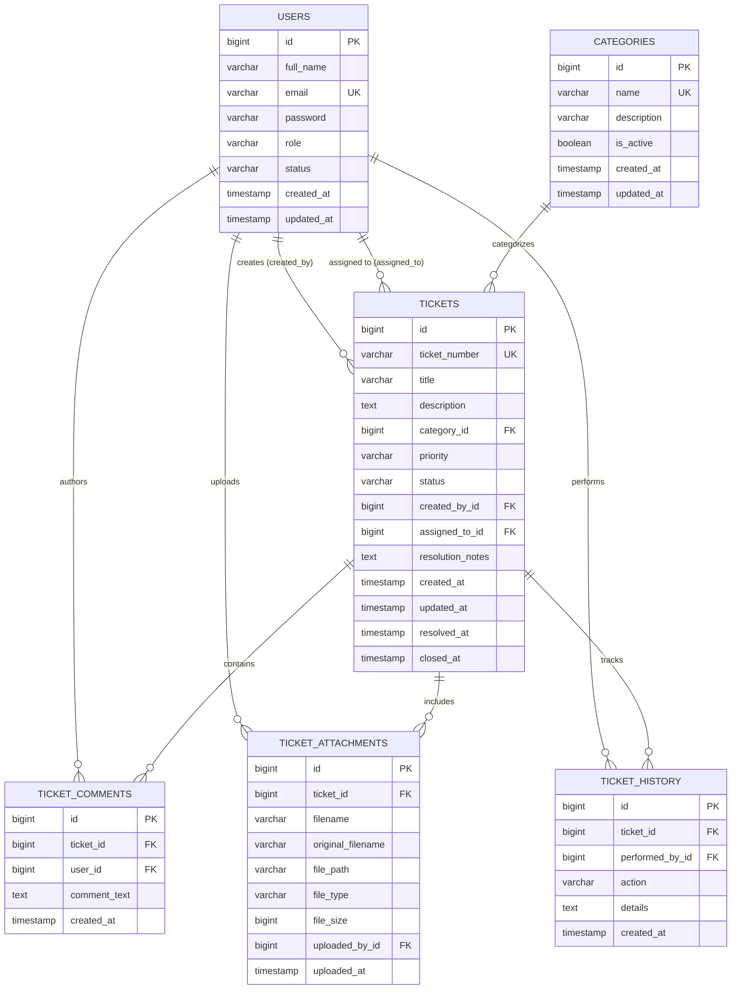

# Database Design & Entity Relationships

Smart ServiceDesk utilizes a relational schema implemented in **MySQL 8.0+** using the **InnoDB** storage engine. The design emphasizes normalization, referential integrity, indexing for high-frequency queries, and comprehensive auditability.

---

## 1. Entity-Relationship Diagram (ERD)

---

## 2. Table Specifications & Indexes

### A. `users` Table
Stores authentication credentials, user profiles, and operational roles.
| Column | Type | Constraints | Description |
|---|---|---|---|
| `id` | BIGINT | PRIMARY KEY, AUTO_INCREMENT | Unique user identifier |
| `full_name` | VARCHAR(100) | NOT NULL | User's complete legal name |
| `email` | VARCHAR(150) | NOT NULL, UNIQUE | Corporate email address |
| `password` | VARCHAR(255) | NOT NULL | BCrypt password hash |
| `role` | VARCHAR(30) | NOT NULL, DEFAULT 'EMPLOYEE' | `EMPLOYEE`, `SUPPORT_AGENT`, `ADMIN` |
| `status` | VARCHAR(20) | NOT NULL, DEFAULT 'ACTIVE' | `ACTIVE`, `INACTIVE` |
| `created_at` | TIMESTAMP | NOT NULL, DEFAULT CURRENT_TIMESTAMP | Account creation time |
| `updated_at` | TIMESTAMP | DEFAULT CURRENT_TIMESTAMP ON UPDATE | Account update time |

**Indexes:**
- `idx_users_email` on (`email`) for rapid login lookups.
- `idx_users_role` on (`role`) for agent and administrator lookups.
- `idx_users_status` on (`status`) for active user validation.

---

### B. `categories` Table
Service catalog taxonomy for classifying technical inquiries.
| Column | Type | Constraints | Description |
|---|---|---|---|
| `id` | BIGINT | PRIMARY KEY, AUTO_INCREMENT | Category identifier |
| `name` | VARCHAR(100) | NOT NULL, UNIQUE | Category title (e.g. Hardware, Security) |
| `description` | VARCHAR(255) | NULL | Scope of issues covered by this category |
| `is_active` | BOOLEAN | NOT NULL, DEFAULT TRUE | Soft-delete / activation flag |
| `created_at` | TIMESTAMP | NOT NULL, DEFAULT CURRENT_TIMESTAMP | Created timestamp |
| `updated_at` | TIMESTAMP | DEFAULT CURRENT_TIMESTAMP ON UPDATE | Last modified timestamp |

**Indexes:**
- `idx_categories_active` on (`is_active`) for fast frontend form dropdown lookups.

---

### C. `tickets` Table
Core business entity representing an IT service request or incident report.
| Column | Type | Constraints | Description |
|---|---|---|---|
| `id` | BIGINT | PRIMARY KEY, AUTO_INCREMENT | Internal primary key |
| `ticket_number` | VARCHAR(30) | NOT NULL, UNIQUE | Enterprise ID (e.g. `INC-2026-00001`) |
| `title` | VARCHAR(200) | NOT NULL | Brief summary of the incident |
| `description` | TEXT | NOT NULL | Full incident description and error details |
| `category_id` | BIGINT | NOT NULL, FK -> categories(id) | Associated category |
| `priority` | VARCHAR(20) | NOT NULL, DEFAULT 'MEDIUM' | `LOW`, `MEDIUM`, `HIGH`, `CRITICAL` |
| `status` | VARCHAR(20) | NOT NULL, DEFAULT 'OPEN' | `OPEN`, `ASSIGNED`, `IN_PROGRESS`, `RESOLVED`, `CLOSED` |
| `created_by_id` | BIGINT | NOT NULL, FK -> users(id) | Submitter (Employee) |
| `assigned_to_id` | BIGINT | NULL, FK -> users(id) | Assigned specialist (Agent/Admin) |
| `resolution_notes`| TEXT | NULL | Solution description provided on resolve |
| `created_at` | TIMESTAMP | NOT NULL, DEFAULT CURRENT_TIMESTAMP | Submission timestamp |
| `updated_at` | TIMESTAMP | DEFAULT CURRENT_TIMESTAMP ON UPDATE | Modification timestamp |
| `resolved_at` | TIMESTAMP | NULL | Time marked as RESOLVED |
| `closed_at` | TIMESTAMP | NULL | Time confirmed and CLOSED |

**Indexes:**
- `idx_tickets_ticket_number` on (`ticket_number`) for quick lookup.
- `idx_tickets_status` on (`status`) for dashboard KPI aggregation.
- `idx_tickets_priority` on (`priority`) for triage sorting.
- `idx_tickets_created_by` on (`created_by_id`) for employee's ticket list.
- `idx_tickets_assigned_to` on (`assigned_to_id`) for agent's queue.
- `idx_tickets_created_at` on (`created_at`) for trend analysis.

---

### D. `ticket_comments` Table
Threaded conversation between requester and assigned IT specialists.
| Column | Type | Constraints | Description |
|---|---|---|---|
| `id` | BIGINT | PRIMARY KEY, AUTO_INCREMENT | Comment identifier |
| `ticket_id` | BIGINT | NOT NULL, FK -> tickets(id) ON DELETE CASCADE | Parent ticket |
| `user_id` | BIGINT | NOT NULL, FK -> users(id) | Comment author |
| `comment_text` | TEXT | NOT NULL | Message content |
| `created_at` | TIMESTAMP | NOT NULL, DEFAULT CURRENT_TIMESTAMP | Comment timestamp |

---

### E. `ticket_attachments` Table
File metadata for uploaded screenshots, system diagnostic logs, and documents.
| Column | Type | Constraints | Description |
|---|---|---|---|
| `id` | BIGINT | PRIMARY KEY, AUTO_INCREMENT | Attachment identifier |
| `ticket_id` | BIGINT | NOT NULL, FK -> tickets(id) ON DELETE CASCADE | Target ticket |
| `filename` | VARCHAR(255) | NOT NULL | Sanitized unique storage name |
| `original_filename`| VARCHAR(255) | NOT NULL | Original uploaded filename |
| `file_path` | VARCHAR(500) | NOT NULL | Relative storage location |
| `file_type` | VARCHAR(100) | NOT NULL | MIME content type |
| `file_size` | BIGINT | NOT NULL | File size in bytes |
| `uploaded_by_id` | BIGINT | NOT NULL, FK -> users(id) | Uploader user ID |
| `uploaded_at` | TIMESTAMP | NOT NULL, DEFAULT CURRENT_TIMESTAMP | Upload timestamp |

---

### F. `ticket_history` Table
Immutable audit trail tracking all actions taken on a ticket throughout its life cycle.
| Column | Type | Constraints | Description |
|---|---|---|---|
| `id` | BIGINT | PRIMARY KEY, AUTO_INCREMENT | Audit record ID |
| `ticket_id` | BIGINT | NOT NULL, FK -> tickets(id) ON DELETE CASCADE | Target ticket |
| `performed_by_id`| BIGINT | NOT NULL, FK -> users(id) | Actor user ID |
| `action` | VARCHAR(100) | NOT NULL | Event name (e.g. `Status Changed`, `Assigned`) |
| `details` | TEXT | NOT NULL | Human-readable explanation of change |
| `created_at` | TIMESTAMP | NOT NULL, DEFAULT CURRENT_TIMESTAMP | Event timestamp |
